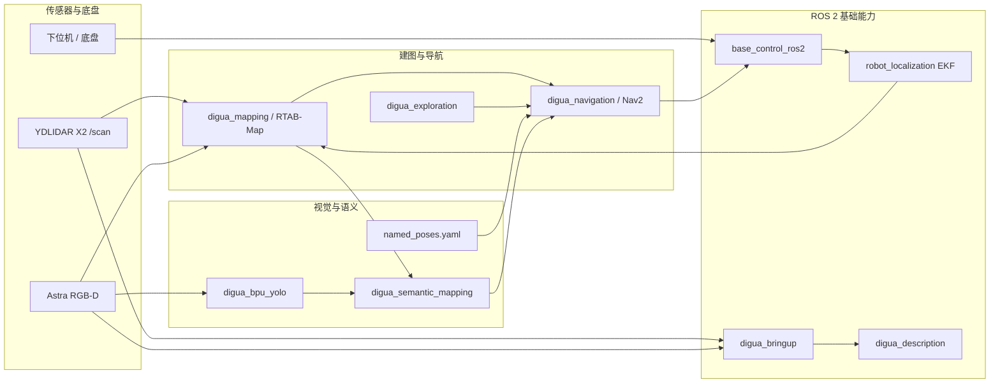

# 地瓜机器人 / RDXx5robot

基于 **RDK X5 + ROS 2** 的室内语义交互导航机器人工作空间。项目面向室内服务、远程巡检、无人值守看护和机器人教学科研场景，目标是让机器人完成从环境感知、建图定位、路径导航、视觉识别、语义地图构建到自然语言任务执行的闭环。

本仓库当前重点保存 ROS 2 工作空间源码、机器人模型、地图与语义数据、BPU 视觉模型、调试脚本和测试资料。作品报告中描述的飞书机器人、DeepSeek API、图片/视频/录音回传等远程交互能力属于系统闭环的一部分；当前仓库主要承载其下游可执行的机器人能力。

## 项目定位

地瓜机器人是一套运行在 RDK X5 上的室内移动机器人系统：

- 上位机：RDK X5，运行 ROS 2、RTAB-Map、Nav2、BPU YOLO、语义地图节点等高层任务。
- 下位机：Nano/底盘控制板，负责电机、转向舵机、编码器、IMU、电池状态与底盘实时控制。
- 运动平台：阿克曼移动底盘，需要在导航参数、行为树和目标点选择上避免原地旋转式控制。
- 感知设备：YDLIDAR X2 激光雷达、Astra RGB-D 相机、IMU、里程计。
- 核心能力：自主建图、定位导航、自主探索、目标识别、语义地图、命名点位导航、硬件自检与调试。

整体闭环可以概括为：

```text
传感器数据
  -> ROS 2 驱动与 TF
  -> RTAB-Map / Nav2 / BPU YOLO
  -> 几何地图 + 语义地图
  -> 命名点位或语义目标
  -> Nav2 NavigateToPose
  -> /cmd_vel
  -> 底盘控制节点
  -> 下位机与阿克曼底盘
```

## 当前能力

- 底盘控制：`base_control_ros2` 订阅 `/cmd_vel`，对接底盘串口，并发布 `/odom`、`/imu`、`/battery` 等状态话题。
- 一键启动：`digua_bringup` 组合机器人描述、底盘、EKF、YDLIDAR X2、Astra 相机和 RGB-D 同步节点。
- 机器人模型：`digua_description` 提供 URDF/Xacro、RViz 配置和模型显示启动文件。
- 建图定位：`digua_mapping` 使用 RTAB-Map 融合 RGB-D、激光雷达和 EKF 里程计，支持在线建图和 Nav2 地图保存。
- 导航规划：`digua_navigation` 基于 Nav2 和 AMCL，包含阿克曼底盘相关参数、行为树、命名点位保存与导航脚本。
- 自主探索：`digua_exploration` 实现 frontier exploration，通过 Nav2 自动前往未知边界区域。
- 视觉识别：`digua_bpu_yolo` 封装 RDK X5 BPU YOLOv8 Open Images V7 推理，并向语义地图发布检测结果。
- 语义地图：`digua_semantic_mapping` 将目标检测、深度图和 TF 转换融合为 `map` 坐标系下的语义目标。
- 调试验证：`tools` 中包含底盘串口、雷达方向、IMU 方向、EKF 航向、硬件总检和地图导出等脚本。

## 系统特点

这个工作空间不是单一算法 demo，而是围绕一台真实移动机器人整理出来的工程项目。它的价值主要体现在三点：

- **真实硬件闭环**：从 `/cmd_vel` 到下位机串口控制，再到 `/odom`、`/imu`、`/battery` 回传，底盘控制链路已经接入 ROS 2。
- **建图导航闭环**：RTAB-Map 负责在线建图和视觉定位，Nav2 负责路径规划、局部避障和目标点执行，命名点位文件承担巡航和语义指令的中间层。
- **视觉语义闭环**：YOLO 在 RDK X5 BPU 上推理，检测结果结合深度图和 TF 转换写入语义地图，再由语义导航节点转换为 Nav2 目标。

因此，本仓库既可以作为比赛作品的工程源码，也适合作为 RDK X5、ROS 2 移动机器人、Nav2、RTAB-Map、BPU 视觉推理和语义地图的综合学习项目。

## 仓库规模

文件统计基于当前仓库快照，忽略隐藏目录，仅统计工程可见内容。仓库约有 **529 个文件**，其中 ROS 2 源码与第三方驱动主要集中在 `src/`。

| 路径 | 文件数 | 作用 |
| --- | ---: | --- |
| `src/` | 430 | ROS 2 工作空间源码，包含自研机器人功能包、传感器驱动和第三方 SDK。 |
| `calib_images/` | 50 | 相机或模型标定图片，当前为一组 `model_calib_20260514_210005` 标定样本。 |
| `config/` | 23 | BPU/TROS 示例配置、类别列表和测试图片，主要用于模型推理或部署验证。 |
| `tools/` | 10 | 硬件检查、传感器方向校验、地图集导出与语义白名单检查脚本。 |
| `digua_maps/` | 4 | 地图与语义地图数据，包含当前地图名、语义地图 JSON 与备份。 |
| `models/` | 3 | RDK X5 BPU 可运行的 YOLOv8s Open Images V7 模型、类别文件和转换日志。 |
| `digua_navigation_data/` | 1 | 导航业务数据，当前保存 `named_poses.yaml` 命名点位。 |
| `test_logs/` | 1 | 调试记录与测试日志，当前包含视觉 ICP/TF 静态测试日志。 |
| `Ackermann_Steering_Chassis_Models/` | 1 | 阿克曼底盘机械 STEP 模型。 |
| 根目录文件 | 6 | Git 配置、许可证、README、快速开始文档、相机反馈样例图等入口文件。 |

## ROS 2 包说明

| 包或模块 | 文件数 | 类型 | 说明 |
| --- | ---: | --- | --- |
| `base_control_ros2` | 18 | `ament_python` | 底盘串口控制节点，连接 `/cmd_vel` 与下位机，发布里程计、电池和 IMU 状态。 |
| `digua_bringup` | 8 | `ament_cmake` | 真实机器人总启动入口，组合 URDF、底盘、EKF、雷达、相机和 RGB-D 同步。 |
| `digua_description` | 6 | `ament_cmake` | 机器人 URDF/Xacro、RViz 与模型显示启动文件。 |
| `digua_mapping` | 8 | `ament_cmake` | RTAB-Map 在线建图、定位和 Nav2 栅格地图保存启动文件。 |
| `digua_navigation` | 21 | `ament_cmake` | Nav2/AMCL 参数、阿克曼行为树、命名点位保存、点位导航和巡航脚本。 |
| `digua_exploration` | 8 | `ament_python` | Frontier 自主探索节点，根据未知边界生成 Nav2 目标点。 |
| `digua_bpu_yolo` | 18 | `ament_python` | RDK X5 BPU YOLO 推理封装，发布 `/semantic/detections_json` 检测结果。 |
| `digua_semantic_mapping` | 20 | `ament_python` | 语义观测、语义融合、语义地图查询、RViz marker 和语义目标导航。 |
| `ros2_astra_camera` | 104 | `ament_cmake` | Astra/Orbbec RGB-D 相机 ROS 2 驱动和消息定义。 |
| `ydlidar_ros2_driver` | 29 | `ament_cmake` | YDLIDAR ROS 2 驱动，当前包含 X2 等多型号参数文件。 |
| `YDLidar-SDK` | 190 | CMake/SDK | YDLIDAR 官方 SDK 源码、示例和文档。 |

## 目录结构

```text
RDXx5robot-main/
├── src/                              # ROS 2 工作空间源码
│   ├── base_control_ros2/            # 底盘串口控制
│   ├── digua_bringup/                # 真实机器人总启动
│   ├── digua_description/            # 机器人模型与 RViz
│   ├── digua_mapping/                # RTAB-Map 建图/定位
│   ├── digua_navigation/             # Nav2 导航、命名点位和巡航
│   ├── digua_exploration/            # frontier 自主探索
│   ├── digua_bpu_yolo/               # RDK X5 BPU YOLO 推理
│   ├── digua_semantic_mapping/       # 语义地图构建与语义目标导航
│   ├── ros2_astra_camera/            # Astra RGB-D 相机驱动
│   ├── ydlidar_ros2_driver/          # YDLIDAR ROS 2 驱动
│   └── YDLidar-SDK/                  # YDLIDAR SDK
├── digua_maps/                       # Nav2/RTAB-Map/语义地图数据
├── digua_navigation_data/            # 命名点位和巡航点数据
├── models/                           # BPU 模型文件
├── config/                           # 模型推理配置与示例资源
├── calib_images/                     # 标定图片
├── tools/                            # 自检与调试工具
├── test_logs/                        # 测试日志
├── Ackermann_Steering_Chassis_Models/# 机械模型
├── QUICK_START.md                    # 快速开始、常用命令和关键数据文件
└── README.md                         # GitHub 首页说明
```

## 数据流与模块关系



## 快速开始与常用命令

快速启动、分模块启动、建图、定位、导航、语义地图管理、命名点位导航以及关键数据文件说明已经独立到：

> [QUICK_START.md：快速开始与关键数据文件](./QUICK_START.md)

主 README 只保留项目总览；实际调车、建图和比赛演示前建议直接打开上面的文档按场景查命令。

## 当前状态与下一步

当前仓库已经具备比较完整的移动机器人基础框架：底盘、雷达、相机、模型、建图、定位、导航、探索、视觉识别和语义地图模块都已落入 ROS 2 工作空间。下一步建议按规范化优先级推进：

1. 固化 `~/digua_ws` 路径约定，减少 launch 和脚本中的硬编码绝对路径。
2. 为 `digua_bringup` 增加分场景启动入口，例如 `bringup_minimal`、`bringup_mapping`、`bringup_navigation`、`bringup_semantic`。
3. 将飞书/DeepSeek/语音交互层独立成 ROS 2 包，例如 `digua_agent` 或 `digua_feishu_bridge`。
4. 为每个自研包补充包内 README，说明节点、话题、参数、launch 命令和调试方法。
5. 将地图、语义地图、命名点位和测试日志分成示例数据与运行数据，避免后续提交混杂。
6. 增加统一的 bringup 自检脚本，自动检查串口、TF、话题、Nav2 lifecycle、BPU 模型和地图文件。

## 维护约定

- 自研 ROS 2 包统一放在 `src/digua_*` 或明确命名的功能目录中。
- 第三方驱动或 SDK 保持独立目录，避免与自研节点混写。
- 可复现实验数据、小样例和标定资源可以入库；长期运行产生的大地图、视频、日志建议外部归档。
- 新增 launch 文件时应注明默认话题、默认路径、是否适合在 RDK X5 上直接运行。
- 修改 Nav2、RTAB-Map、EKF 或 TF 参数后，应同步记录测试场景与现象，便于复现实车问题。

## 许可证

根目录许可证为 Apache-2.0。部分第三方驱动、SDK 或模型文件可能带有各自许可证和使用限制，二次分发或比赛提交前应分别核对。
