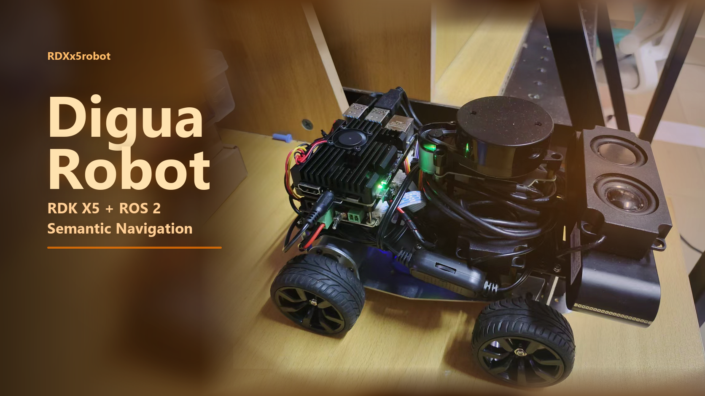
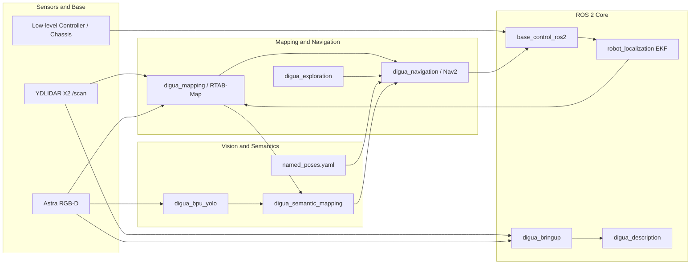

<div align="center">

<p>
  
</p>

# Digua Robot / RDXx5robot

<p>
  <a href="./README.md"><strong>English</strong></a>
  |
  <a href="./README.zh-CN.md"><strong>简体中文</strong></a>
</p>

<p>
  
  
  
  
  
</p>

<p><strong>Indoor semantic interactive navigation robot workspace based on RDK X5 and ROS 2.</strong></p>

</div>

This repository contains a ROS 2 workspace for an indoor mobile robot that closes the loop from perception, mapping, localization, navigation, visual recognition, and semantic map construction to natural-language task execution.

The repository currently focuses on ROS 2 workspace source code, robot models, maps and semantic data, BPU vision models, debugging scripts, and test artifacts. Remote interaction capabilities described in the project report, such as Feishu bot integration, DeepSeek API calls, and image/video/audio feedback, belong to the larger system loop; this repository mainly contains the downstream robot capabilities that run on the vehicle.

## Project Positioning

Digua Robot is an indoor mobile robot system running on RDK X5:

- Host computer: RDK X5, running ROS 2, RTAB-Map, Nav2, BPU YOLO, semantic mapping nodes, and other high-level tasks.
- Low-level controller: Nano/chassis control board, responsible for motors, steering servo, encoders, IMU, battery status, and real-time chassis control.
- Motion platform: Ackermann mobile chassis. Navigation parameters, behavior trees, and goal selection avoid differential-drive style in-place rotation.
- Sensors: YDLIDAR X2 LiDAR, Astra RGB-D camera, IMU, and odometry.
- Core capabilities: autonomous mapping, localization, navigation, exploration, object detection, semantic mapping, named-pose navigation, hardware checks, and debugging.

The overall loop is:

```text
Sensor data
  -> ROS 2 drivers and TF
  -> RTAB-Map / Nav2 / BPU YOLO
  -> geometric map + semantic map
  -> named pose or semantic target
  -> Nav2 NavigateToPose
  -> /cmd_vel
  -> base control node
  -> low-level controller and Ackermann chassis
```

## Current Capabilities

- Base control: `base_control_ros2` subscribes to `/cmd_vel`, communicates with the chassis serial port, and publishes `/odom`, `/imu`, `/battery`, and related status topics.
- Bringup: `digua_bringup` composes robot description, base control, EKF, YDLIDAR X2, Astra camera, and RGB-D synchronization.
- Robot description: `digua_description` provides URDF/Xacro, RViz configuration, and display launch files.
- Mapping and localization: `digua_mapping` uses RTAB-Map to fuse RGB-D, LiDAR, and EKF odometry, supporting online mapping and Nav2 map saving.
- Navigation: `digua_navigation` provides Nav2 and AMCL parameters, Ackermann-aware behavior trees, named-pose saving, goal navigation, and route scripts.
- Autonomous exploration: `digua_exploration` implements frontier exploration and sends generated exploration goals to Nav2.
- Visual recognition: `digua_bpu_yolo` wraps RDK X5 BPU YOLOv8 Open Images V7 inference and publishes detection results for the semantic mapping stack.
- Semantic mapping: `digua_semantic_mapping` fuses object detection, depth images, and TF into semantic targets in the `map` frame.
- Debugging and validation: `tools` contains scripts for base serial checks, LiDAR direction checks, IMU direction checks, EKF yaw checks, hardware inspection, map export, and semantic whitelist checks.

## System Highlights

This workspace is not a single algorithm demo. It is an engineering project organized around a real mobile robot. Its value is mainly in three loops:

- Real hardware loop: `/cmd_vel` is converted to low-level serial chassis commands, while `/odom`, `/imu`, and `/battery` are returned to ROS 2.
- Mapping and navigation loop: RTAB-Map performs online mapping and visual localization, while Nav2 performs planning, local obstacle avoidance, and goal execution. Named poses serve as the intermediate layer for patrol and semantic commands.
- Visual semantic loop: YOLO runs on the RDK X5 BPU, detections are fused with depth and TF into a semantic map, and semantic navigation nodes convert targets into Nav2 goals.

The repository can be used as engineering source for a competition project, and also as a learning project for RDK X5, ROS 2 mobile robots, Nav2, RTAB-Map, BPU vision inference, and semantic mapping.

## Repository Size

The file statistics below are based on the current repository snapshot and ignore hidden directories. The repository has about **530 visible files**, with ROS 2 source and third-party drivers mainly under `src/`.

| Path | Files | Purpose |
| --- | ---: | --- |
| `src/` | 430 | ROS 2 workspace source, including project packages, sensor drivers, and third-party SDKs. |
| `calib_images/` | 50 | Project-captured calibration images, currently one `model_calib_20260514_210005` sample set. |
| `config/` | 23 | BPU/TROS sample configs, class lists, and test images for model inference or deployment validation. |
| `tools/` | 10 | Hardware checks, sensor direction checks, map export, and semantic whitelist utilities. |
| `digua_maps/` | 4 | Map and semantic map data, including the current map name, semantic map JSON, and backups. |
| `models/` | 4 | RDK X5 BPU YOLOv8s Open Images V7 model, class file, conversion log, and model card. |
| `digua_navigation_data/` | 1 | Navigation business data, currently `named_poses.yaml`. |
| `test_logs/` | 1 | Debug and test logs, currently a visual ICP/TF static test log. |
| `Ackermann_Steering_Chassis_Models/` | 1 | Project-authored Ackermann chassis STEP model. |
| Root files | 8 | Git config, license, bilingual READMEs, quick start, third-party notices, and sample feedback image. |

## ROS 2 Packages

| Package or module | Files | Type | Description |
| --- | ---: | --- | --- |
| `base_control_ros2` | 18 | `ament_python` | Base serial control node connecting `/cmd_vel` to the low-level controller, while publishing odometry, battery, and IMU status. |
| `digua_bringup` | 8 | `ament_cmake` | Main real-robot bringup entry, composing URDF, base, EKF, LiDAR, camera, and RGB-D sync. |
| `digua_description` | 6 | `ament_cmake` | Robot URDF/Xacro, RViz config, and model display launch files. |
| `digua_mapping` | 8 | `ament_cmake` | RTAB-Map online mapping, localization, and Nav2 grid map saving launch files. |
| `digua_navigation` | 21 | `ament_cmake` | Nav2/AMCL parameters, Ackermann behavior tree, named-pose saving, point navigation, and route scripts. |
| `digua_exploration` | 8 | `ament_python` | Frontier exploration node that generates Nav2 goals from unknown map boundaries. |
| `digua_bpu_yolo` | 18 | `ament_python` | RDK X5 BPU YOLO inference wrapper that publishes `/semantic/detections_json`. |
| `digua_semantic_mapping` | 20 | `ament_python` | Semantic observation, fusion, map query, RViz markers, and semantic target navigation. |
| `ros2_astra_camera` | 104 | `ament_cmake` | Astra/Orbbec RGB-D camera ROS 2 driver and message definitions. |
| `ydlidar_ros2_driver` | 29 | `ament_cmake` | YDLIDAR ROS 2 driver with parameter files for X2 and other models. |
| `YDLidar-SDK` | 190 | CMake/SDK | Official YDLIDAR SDK source, examples, and documentation. |

## Directory Layout

```text
RDXx5robot-main/
├── src/                              # ROS 2 workspace source
│   ├── base_control_ros2/            # Base serial control
│   ├── digua_bringup/                # Real-robot bringup
│   ├── digua_description/            # Robot model and RViz
│   ├── digua_mapping/                # RTAB-Map mapping/localization
│   ├── digua_navigation/             # Nav2 navigation, named poses, and routes
│   ├── digua_exploration/            # Frontier exploration
│   ├── digua_bpu_yolo/               # RDK X5 BPU YOLO inference
│   ├── digua_semantic_mapping/       # Semantic map construction and target navigation
│   ├── ros2_astra_camera/            # Astra RGB-D camera driver
│   ├── ydlidar_ros2_driver/          # YDLIDAR ROS 2 driver
│   └── YDLidar-SDK/                  # YDLIDAR SDK
├── digua_maps/                       # Nav2 / RTAB-Map / semantic map data
├── digua_navigation_data/            # Named poses and route data
├── models/                           # BPU model files
├── config/                           # Model inference configs and sample resources
├── calib_images/                     # Calibration images
├── tools/                            # Check and debugging tools
├── test_logs/                        # Test logs
├── Ackermann_Steering_Chassis_Models/# Mechanical model
├── QUICK_START.md                    # Quick start, common commands, and key data files
├── THIRD_PARTY_NOTICES.md            # Third-party and asset notices
├── README.zh-CN.md                   # Simplified Chinese README
└── README.md                         # Default English README
```

## Data Flow



## Quick Start

Quick start, per-module launch commands, mapping, localization, navigation, semantic map management, named-pose navigation, and key data file notes live in:

> [QUICK_START.md: Quick start and key data files](./QUICK_START.md)

The main README keeps the project overview. For real-robot debugging, mapping, and competition demos, use `QUICK_START.md` as the command reference.

## Current Status and Next Steps

The repository already contains a relatively complete mobile robot base framework: base control, LiDAR, camera, model files, mapping, localization, navigation, exploration, visual recognition, and semantic mapping are all included in the ROS 2 workspace.

Suggested next steps:

1. Stabilize the `~/digua_ws` path convention and reduce hard-coded absolute paths in launch files and scripts.
2. Add scenario-specific bringup entries in `digua_bringup`, such as `bringup_minimal`, `bringup_mapping`, `bringup_navigation`, and `bringup_semantic`.
3. Split the Feishu, DeepSeek, and voice interaction layer into a dedicated ROS 2 package, such as `digua_agent` or `digua_feishu_bridge`.
4. Add package-level READMEs for every project-maintained package, documenting nodes, topics, parameters, launch commands, and debugging methods.
5. Separate maps, semantic maps, named poses, and test logs into sample data and runtime data to avoid mixing generated artifacts into later commits.
6. Add a unified bringup self-check script for serial devices, TF, topics, Nav2 lifecycle, BPU models, and map files.

## Maintenance Conventions

- Project-maintained ROS 2 packages live under `src/digua_*` or clearly named functional directories.
- Third-party drivers and SDKs stay in independent directories and should not be mixed with project-maintained nodes.
- Reproducible experimental data, small samples, and calibration resources may be kept in the repository; large maps, videos, and long-running logs should be archived externally.
- New launch files should document default topics, default paths, and whether they are ready for direct use on RDK X5.
- After changing Nav2, RTAB-Map, EKF, or TF parameters, record the test scene and observed behavior for reproducibility.

## License

Unless otherwise stated, original project code is licensed under the root [Apache-2.0](./LICENSE) license.

This repository also contains official third-party drivers/SDKs, referenced or adapted code, model files, and runtime data. These files are not automatically covered by the root Apache-2.0 license. See [THIRD_PARTY_NOTICES.md](./THIRD_PARTY_NOTICES.md) for sources, license status, and redistribution notes.
